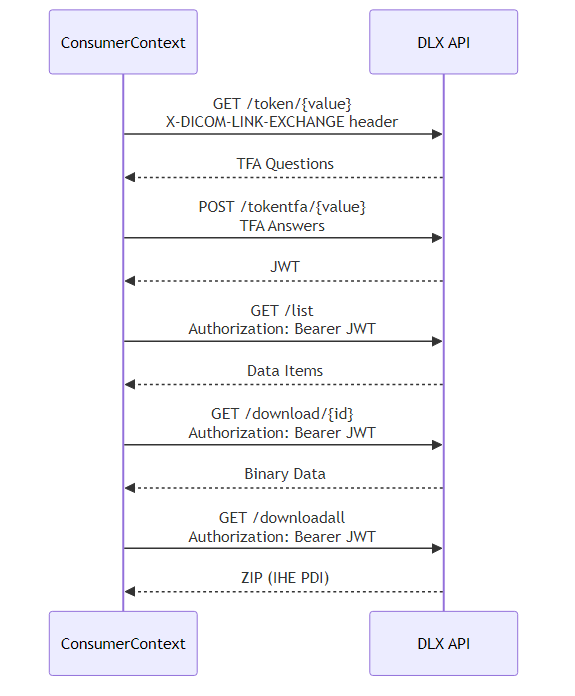
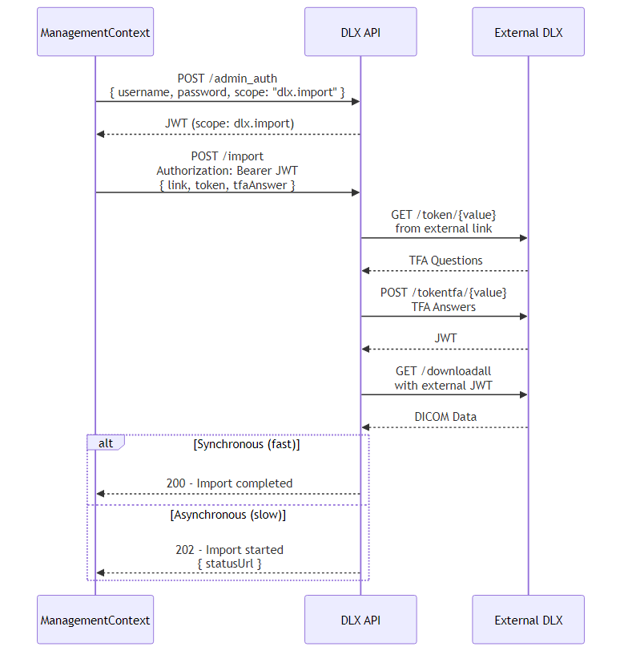
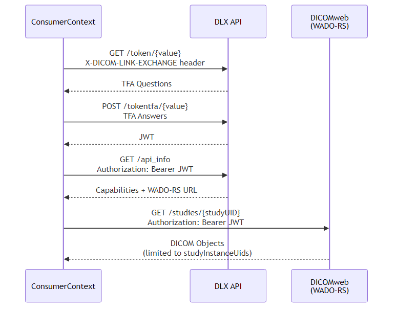

# DLX API - DICOM Link Exchange

[](https://swagger.io/specification/)
[](openapi.yaml)

## Übersicht

Die **DLX API** (DICOM Link Exchange) ist eine Initiative von Herstellern medizinischer Bildgebungssoftware zur Standardisierung von Downloads aus ihren Systemen. Diese OpenAPI-Spezifikation definiert die Schnittstellen für den sicheren Austausch von medizinischen Bilddaten (DICOM) und zugehörigen Dokumenten.

## Hauptmerkmale

- 🔐 **Zwei-Faktor-Authentifizierung (TFA)** für sicheren Patienten-Zugriff
- 🔑 **OpenID Connect (OIDC)** für administrative Zugriffe
- 📦 **IHE PDI konforme** DICOM-Downloads
- 🔄 **Import-Funktionalität** für externen Datenaustausch
- 🌳 **Token Derivation** für eingeschränkte Untertokens
- 🏥 **DICOMweb-Integration** für WADO-RS und QIDO-RS Zugriff

## API-Rollen

Die DLX API unterscheidet drei Hauptrollen:

| Rolle | Beschreibung | Authentifizierung |
|-------|--------------|-------------------|
| **DLX-Consumer** | Patienten/Ärzte, die Daten über Token-Links herunterladen | TFA → JWT |
| **DLX-Creator** | Administratoren, die Token-Links erstellen und verwalten | OIDC (Scope: `dlx.creator`) |
| **DLX-Importer** | Systeme, die Daten von externen DLX-Instanzen importieren | OIDC (Scope: `dlx.importer`) |

---

## Workflows

### DLX-Consumer Workflow

Patienten oder Ärzte erhalten einen Token-Link (z.B. per E-Mail oder QR-Code) und laden damit medizinische Daten herunter.



**Schritte:**
1. **Token abrufen**: `GET /token/{value}` mit `X-DICOM-LINK-EXCHANGE` Header
2. **TFA beantworten**: `POST /tokentfa/{value}` mit Antworten
3. **JWT erhalten**: Bei erfolgreicher Authentifizierung
4. **Daten auflisten**: `GET /list` mit Bearer-Token
5. **Daten herunterladen**: `GET /download/{id}` oder `GET /downloadall`

### DLX-Creator Workflow

Administratoren erstellen Token-Links für Patienten, um diesen Zugriff auf ihre medizinischen Daten zu gewähren.


**Schritte:**
1. **OIDC-Login**: Authentifizierung mit `dlx.creator` Scope
2. **Token erstellen**: `POST /tokens` mit Patienten- und Studiendaten
3. **TFA konfigurieren**: Optional Sicherheitsfragen definieren
4. **Link versenden**: Token-Link an Patienten senden

### DLX-Importer Workflow

Systeme importieren Daten von externen DLX-Instanzen (z.B. andere Krankenhäuser).



**Schritte:**
1. **OIDC-Login**: Authentifizierung mit `dlx.importer` Scope
2. **Import anstoßen**: `POST /import` mit externem Link und TFA-Daten
3. **Daten empfangen**: Synchron (200) oder asynchron (202)

### DICOMweb WADO-RS Workflow

Der DLX Bearer Token kann für den Zugriff auf DICOMweb WADO-RS Endpunkte verwendet werden.



**Schritte:**
1. **Token abrufen**: `GET /token/{value}` mit `X-DICOM-LINK-EXCHANGE` Header
2. **TFA beantworten**: `POST /tokentfa/{value}` mit Antworten
3. **JWT erhalten**: Bei erfolgreicher Authentifizierung
4. **API-Info abrufen**: `GET /api_info` (optional) um WADO-RS URL zu erhalten
5. **WADO-RS aufrufen**: Mit Bearer Token auf WADO-RS Endpunkte zugreifen
6. **DICOM-Daten empfangen**: Zugriff limitiert auf `studyInstanceUids` des Tokens

**WADO-RS Endpunkte:**
- `GET /studies/{studyUID}` - Studie abrufen
- `GET /studies/{studyUID}/series` - Serien einer Studie
- `GET /studies/{studyUID}/series/{seriesUID}/instances` - Instanzen einer Serie

### Token Derivation Workflow

DLX-Consumer mit `dlx.derive` Scope können eingeschränkte Untertokens für Dritte erstellen.

**Schritte:**
1. **TFA-Authentifizierung**: Normaler DLX-Consumer Workflow
2. **JWT mit dlx.derive Scope**: Token muss `allowDerivation: true` haben
3. **Untertoken erstellen**: `POST /tokens` mit Bearer-Token (nicht OIDC)
4. **Eingeschränkter Zugriff**: Untertoken kann nur Subset der Eltern-Studien und kürzere Gültigkeit haben

**Einschränkungen für abgeleitete Tokens:**
- `expiresAt` darf nicht über Eltern-Token-Gültigkeit hinausgehen
- `studyInstanceUids` müssen Subset der Eltern-Token-UIDs sein
- Nur eigene abgeleitete Tokens können verwaltet werden (GET, PUT, DELETE)

---

## API-Endpunkte

### Info-Endpunkte

| Endpunkt | Methode | Beschreibung |
|----------|---------|--------------|
| `/api_info` | GET | API-Version und unterstützte Capabilities |
| `/.well-known/openid-configuration` | GET | OIDC Discovery Document |
| `/tfa_info` | GET | Unterstützte TFA-Optionen (authentifiziert) |

### DLX-Consumer Endpunkte

| Endpunkt | Methode | Auth | Beschreibung |
|----------|---------|------|--------------|
| `/token/{value}` | GET | Keine | TFA-Fragen abrufen |
| `/tokentfa/{value}` | POST | Keine | TFA beantworten, JWT erhalten |
| `/list` | GET | JWT | Verfügbare Daten auflisten |
| `/download/{id}` | GET | JWT | Einzelnene Daten herunterladen |
| `/downloadall` | GET | JWT | Alle Daten als ZIP herunterladen |

### DLX-Creator Endpunkte

| Endpunkt | Methode | Auth | Beschreibung |
|----------|---------|------|--------------|
| `/tokens` | GET | OIDC / JWT¹ | Alle Token-Links auflisten (paginiert) |
| `/tokens` | POST | OIDC / JWT¹ | Neuen Token-Link erstellen |
| `/tokens/{token}` | GET | OIDC / JWT¹ | Token-Link-Details abrufen |
| `/tokens/{token}` | PUT | OIDC / JWT¹ | Token-Link aktualisieren |
| `/tokens/{token}` | DELETE | OIDC / JWT¹ | Token-Link löschen |

¹ JWT mit `dlx.derive` Scope für Token Derivation (nur eigene abgeleitete Tokens)

#### Token mit Derivation erstellen (OIDC)

```json
POST /tokens
Authorization: Bearer {oidc_access_token}

{
  "patientId": "PID123",
  "studyInstanceUids": ["1.2.3.4", "5.6.7.8"],
  "expiresAt": "2024-03-10T16:15:50Z",
  "allowDerivation": true
}
```

**Response:**
```json
{
  "link": "https://example.com/dlx/v2/token/ABC-S1Z-98A",
  "token": "ABC-S1Z-98A",
  "issuer": "Example Hospital",
  "issuedAt": "2024-02-10T16:15:50Z",
  "expiresAt": "2024-03-10T16:15:50Z",
  "allowDerivation": true,
  "tfaAnswer": [...]
}
```

#### Abgeleiteten Token erstellen (JWT mit dlx.derive)

```json
POST /tokens
Authorization: Bearer {jwt_with_dlx_derive_scope}

{
  "patientId": "PID123",
  "studyInstanceUids": ["1.2.3.4"],
  "expiresAt": "2024-02-15T16:15:50Z",
  "allowDerivation": false
}
```

**Response (Derived Token):**
```json
{
  "link": "https://example.com/dlx/v2/token/XYZ-D1R-23B",
  "token": "XYZ-D1R-23B",
  "issuer": "Example Hospital",
  "issuedAt": "2024-02-10T16:15:50Z",
  "expiresAt": "2024-02-15T16:15:50Z",
  "allowDerivation": false,
  "parentToken": "ABC-S1Z-98A",
  "tfaAnswer": [...]
}
```

### DLX-Importer Endpunkte

| Endpunkt | Methode | Auth | Beschreibung |
|----------|---------|------|--------------|
| `/import` | POST | OIDC | Daten von externem DLX importieren |

---

## Authentifizierung

### DLX-Consumer (TFA → JWT)

```
┌─────────────┐     GET /token/{value}      ┌─────────────┐
│   Consumer  │ ──────────────────────────► │   DLX API   │
│             │ ◄────────────────────────── │             │
│             │     TFA Questions           │             │
│             │                             │             │
│             │     POST /tokentfa/{value}  │             │
│             │ ──────────────────────────► │             │
│             │ ◄────────────────────────── │             │
│             │     JWT Token               │             │
└─────────────┘                             └─────────────┘
```

### DLX-Creator/Importer (OIDC)

```
┌─────────────┐     OAuth 2.0 Flow         ┌─────────────┐
│  Creator/   │ ──────────────────────────► │    OIDC     │
│  Importer   │ ◄────────────────────────── │   Provider  │
│             │     Access Token           │             │
│             │     (scope: dlx.creator)   │             │
└─────────────┘                             └─────────────┘
```

**Verfügbare OAuth 2.0 Scopes:**

| Scope | Beschreibung |
|-------|--------------|
| `dlx.consumer` | Zugriff auf Download-Endpunkte (/list, /download, /downloadall) |
| `dlx.derive` | Eingeschränkte Untertokens erstellen (Token Derivation) |
| `dlx.creator` | Token-Links erstellen und verwalten |
| `dlx.importer` | Externe DLX-Daten importieren |
| `dlx.admin` | Vollständiger administrativer Zugriff (inkl. creator + importer) |

---

## TFA-Fragetypen

| Typ | Beschreibung | Antwortformat |
|-----|--------------|---------------|
| `PAT_BIRTH_DATE` | Geburtsdatum des Patienten | `DATE` (YYYYMMDD) |
| `STUDY_DATE` | Datum der Untersuchung | `DATE` (YYYYMMDD) |
| `PASSWORD` | OTP oder TOTP | `STRING` |
| `CUSTOM` | Benutzerdefinierte Frage | `STRING` oder `DATE` |

---

## Capabilities

Die `/api_info`-Endpunkt gibt Auskunft über unterstützte Features:

```json
{
  "dlxVersion": "v2",
  "vendorInformation": "DLX Company Ltd.",
  "apiBasePath": "https://example.com/portal/dlx/v2",
  "capabilities": {
    "download": true,
    "tokens": true,
    "import": false,
    "oidc": true,
    "derivation": true,
    "dicomweb": {
      "wadoRs": {
        "available": true,
        "url": "https://example.com/dicomweb/wado-rs"
      },
      "qidoRs": {
        "available": false
      }
    }
  }
}
```

| Capability | Beschreibung |
|------------|--------------|
| `download` | DLX-Consumer Endpunkte verfügbar |
| `tokens` | DLX-Creator Endpunkte verfügbar |
| `import` | DLX-Importer Endpunkte verfügbar |
| `oidc` | OIDC Discovery verfügbar |
| `derivation` | Token Derivation unterstützt (dlx.derive Scope) |
| `dicomweb` | DICOMweb-Dienste (WADO-RS, QIDO-RS) verfügbar |

### DICOMweb-Capabilities

Die DICOMweb-Capabilities beschreiben die verfügbaren DICOMweb-Dienste:

| Capability | Beschreibung |
|------------|--------------|
| `wadoRs` | WADO-RS (DICOM PS3.18 Section 10.4): Retrieve-Dienst für DICOM-Objekte |
| `qidoRs` | QIDO-RS (DICOM PS3.18 Section 10.6): Query-Dienst für DICOM-Objekte |

**Beispiel:**
```json
"dicomweb": {
  "wadoRs": {
    "available": true,
    "url": "https://example.com/dicomweb/wado-rs"
  },
  "qidoRs": {
    "available": false
  }
}
```

Der DLX JWT-Bearer-Token soll für die Authentifizierung an diesen DICOMweb-Endpunkten akzeptiert werden, limitiert auf die `studyInstanceUids`, für die das Token ausgestellt wurde.

---

## Fehlerbehandlung

| Status Code | Beschreibung |
|-------------|--------------|
| `200` | Erfolgreiche Anfrage |
| `202` | Anfrage akzeptiert (asynchrone Verarbeitung) |
| `400` | Ungültige Anfrage |
| `401` | Authentifizierung fehlgeschlagen |
| `403` | Token abgelaufen (aber TFA korrekt) / Derivation nicht erlaubt |
| `404` | Ressource nicht gefunden |
| `500` | Interner Server-Fehler |
| `501` | Endpunkt nicht implementiert |
| `503` | Server überlastet (Retry-Later) |

### Token Derivation Fehler

| Fehler | Beschreibung |
|--------|--------------|
| `derivation_not_allowed` | Token hat keinen `dlx.derive` Scope oder Derivation ist deaktiviert |
| `derivation_exceeds_parent` | Abgeleiteter Token überschreitet Eltern-Token-Beschränkungen (Gültigkeit, Studien-UIDs) |

---

## Validierung

Die OpenAPI-Spezifikation kann mit folgenden Tools validiert werden:

```bash
# Mit swagger-cli
npm install -g @apidevtools/swagger-cli
swagger-cli validate openapi.yaml

# Mit Redocly CLI
npm install -g @redocly/cli
redocly lint openapi.yaml
```

---

## Dokumentation anzeigen

```bash
# Mit Redoc
npx @redocly/cli preview-docs openapi.yaml

# Mit Swagger UI
npx swagger-ui-watcher openapi.yaml
```

---

## Weitere Informationen

- **OpenAPI Spezifikation**: [`openapi.yaml`](openapi.yaml)
- **OIDC Discovery 1.0**: https://openid.net/specs/openid-connect-discovery-1_0.html
- **IHE PDI Profile**: https://www.ihe.net/resources/profiles/

---

## Lizenz

Diese Spezifikation ist Teil der DLX-Initiative zur Standardisierung des Austauschs medizinischer Bilddaten.
